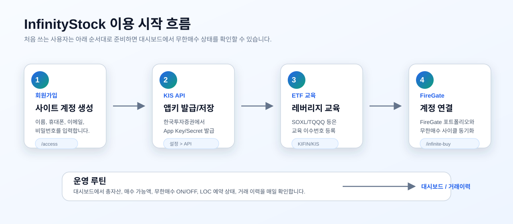
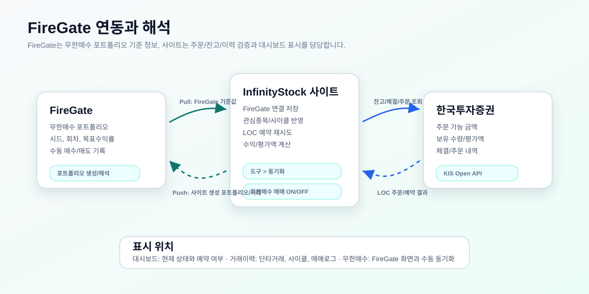
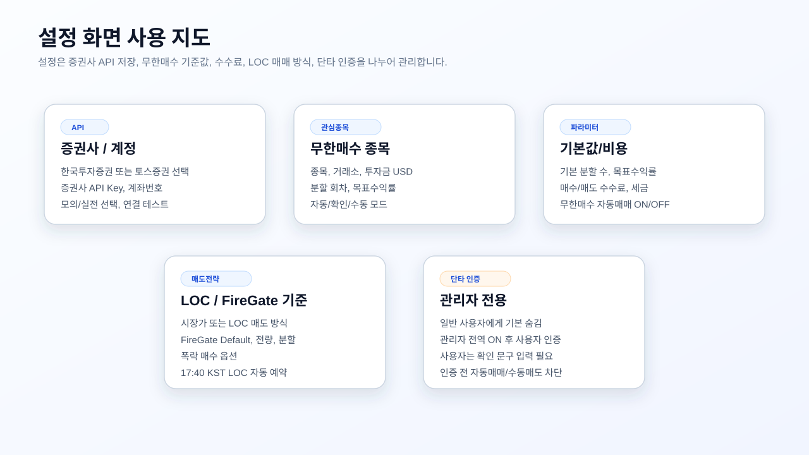

# InfinityStock 사용자 가이드북

_최종 업데이트: 2026-06-18_

이 문서는 일반 사용자가 InfinityStock 사이트를 처음 가입해서 한국투자증권 Open API, 해외 레버리지 ETF 거래 준비, FireGate 연동, 무한매수 운영까지 따라 할 수 있도록 만든 운영 가이드입니다.

> 중요: 이 문서는 사이트 사용 방법 안내입니다. 특정 종목 매수/매도 추천이나 수익 보장을 의미하지 않습니다. 증권사 API 키, 계좌번호, FireGate 계정 같은 민감 정보는 다른 사람에게 공유하지 마세요.

## 전체 흐름



1. 사이트 회원가입
2. 한국투자증권 계좌와 Open API 준비
3. SOXL/TQQQ 같은 해외 레버리지 ETF 거래 교육 이수 및 증권사 등록
4. 사이트 설정에서 증권사를 선택하고 API 저장 후 연결 테스트
5. FireGate 계정 연결 및 포트폴리오 동기화
6. 대시보드에서 무한매수 ON/OFF, LOC 예약, 거래이력 확인

## 준비 체크리스트

운영자가 사용자에게 안내할 때 아래 항목을 순서대로 확인하세요.

- [ ] InfinityStock 사이트 계정 생성 완료
- [ ] 한국투자증권 계좌 보유
- [ ] 한국투자증권 계좌가 한국투자증권 ID에 연결됨
- [ ] KIS Developers 또는 한국투자증권 Open API 메뉴에서 실전 App Key/App Secret 발급
- [ ] 사이트 `설정 > API 설정`에 App Key, App Secret, 계좌번호 저장
- [ ] `연결 테스트` 성공 확인
- [ ] SOXL/TQQQ 등 레버리지 ETF를 거래할 경우 금융투자교육원 교육 이수 및 한국투자증권에 이수번호 등록
- [ ] FireGate 계정 생성 및 로그인 가능
- [ ] 사이트 `무한매수 > FireGate 연결 > 도구 > 동기화` 완료
- [ ] `대시보드`에서 무한매수 자동운영 ON/OFF 상태 확인

## 1. 회원가입과 로그인

### 회원가입

1. 사이트 접속 후 로그인 화면에서 `회원가입`을 누릅니다.
2. 이름, 휴대폰 번호, 이메일, 비밀번호, 비밀번호 확인을 입력합니다.
3. 비밀번호는 8자 이상으로 입력합니다.
4. `회원가입`을 누른 뒤 로그인 화면에서 이메일과 비밀번호로 로그인합니다.

### 아이디 찾기 / 비밀번호 재설정

- `아이디 찾기`: 가입 시 입력한 이름과 휴대폰 번호로 이메일 아이디를 확인합니다.
- `비밀번호 재설정`: 이메일, 이름, 휴대폰 번호를 입력하고 새 비밀번호를 바로 설정합니다.

### 관리자 계정

첫 번째로 생성된 계정은 관리자 권한으로 만들어질 수 있습니다. 일반 사용자는 관리자 기능이 보이지 않는 것이 정상입니다.

## 2. 한국투자증권 API 만들기

InfinityStock은 한국투자증권 Open API를 통해 주문 가능 금액, 잔고, 체결, 주문 등을 조회하고 무한매수 LOC 주문을 처리합니다.

공식 경로:

- 한국투자증권 Open API 포털: <https://apiportal.koreainvestment.com/>
- Open API 사용 안내: <https://apiportal.koreainvestment.com/apiservice>
- KIS Open Trading API GitHub: <https://github.com/koreainvestment/open-trading-api>

### 발급 전 준비

- 한국투자증권 계좌가 있어야 합니다.
- 한국투자증권 ID와 계좌가 연결되어 있어야 합니다.
- 실전투자와 모의투자는 App Key/App Secret이 서로 다릅니다. 실전 주문을 쓸 사용자는 실전 키를 발급해야 합니다.

### App Key / App Secret 발급 순서

1. 한국투자증권 Open API 포털에 접속합니다.
2. 한국투자증권 계정으로 로그인합니다.
3. Open API 신청 메뉴에서 서비스 사용 신청을 진행합니다.
4. 실전 또는 모의 환경을 선택해 App Key와 App Secret을 발급합니다.
5. 발급된 App Key와 App Secret을 안전한 곳에 보관합니다.

> 화면 메뉴명은 한국투자증권 포털 개편에 따라 조금 달라질 수 있습니다. 핵심은 “Open API 신청”, “앱키 발급”, “실전/모의 구분”입니다.

## 3. 사이트에 증권사 API 저장하기

상단 오른쪽 톱니바퀴 아이콘 또는 사용자 메뉴에서 `설정`으로 이동합니다.

`설정 > API 설정`에서 증권사를 먼저 선택한 뒤 아래 값을 입력합니다. 현재 실주문 운영 화면에서는 `한국투자증권`과 `토스증권`만 활성화되어 있습니다.

### 한국투자증권(KIS)

| 항목 | 입력값 | 유의점 |
| --- | --- | --- |
| App Key | KIS에서 발급받은 App Key | 실전/모의 키를 섞지 않습니다. |
| App Secret | KIS에서 발급받은 Secret | 다른 사용자에게 공유하지 않습니다. |
| 계좌번호 | 예: `12345678-01` | 8자리 계좌번호 + 하이픈 + 2자리 상품코드 형식입니다. |
| 모의/실전 | 모의투자 또는 실전투자 | 실전 주문 전 반드시 실전으로 되어 있는지 확인합니다. |

### 토스증권

| 항목 | 입력값 | 유의점 |
| --- | --- | --- |
| Client ID | 토스증권 Open API 콘솔에서 발급받은 Client ID | 해외 ETF 현재가, 보유, 주문가능금액, LOC 주문 경로에 사용합니다. |
| Client Secret | 토스증권 Open API 콘솔에서 발급받은 Secret | 다른 사용자에게 공유하지 않습니다. |
| Account Seq | 계좌 목록의 accountSeq | 비워두면 연결 테스트 시 첫 계좌를 자동 저장할 수 있습니다. |

입력 후 `저장`을 누르고 `연결 테스트`를 실행합니다.

연결 테스트가 실패하면 아래를 확인하세요.

- App Key/App Secret 앞뒤 공백이 들어갔는지
- 실전 키인데 모의투자로 선택했거나, 모의 키인데 실전으로 선택했는지
- 계좌번호 형식이 `12345678-01`인지
- 한국투자증권 Open API 신청이 완료되었는지
- 한국투자증권 계좌가 해당 ID에 연결되어 있는지

### 미장 시세 추적

SOXL/TQQQ처럼 오버나이트 가격이 움직이는 종목은 사이트가 기본 시세 체계로 자동 추적합니다.

- 일반 사용자는 별도 시세 인증정보를 입력하지 않습니다.
- 선택한 증권사 시세와 Yahoo 폴백 시세를 우선 사용합니다.
- 서버에 별도 24시간 시세 공급자가 설정된 경우에도 사용자 설정 화면에는 노출하지 않습니다.

## 4. 해외 ETF 거래 교육 이수하기

SOXL, TQQQ 같은 해외 레버리지 ETF는 일반 해외주식과 다르게 사전 교육 또는 거래 동의가 필요할 수 있습니다.

공식 안내:

- 한국투자증권 해외 레버리지 ETP 사전교육 의무화 안내: <https://m.koreainvestment.com/main/customer/notice/Notice.jsp?cmd=TF04ga000002&num=45727>
- 한국투자증권 FAQ: <https://m.koreainvestment.com/main/customer/support/_static/TF04fg000000.jsp?mctgr=03&sctgr=08>
- 금융투자교육원: <https://www.kifin.or.kr/>

### 기본 절차

1. 금융투자교육원 사이트에 회원가입 또는 로그인합니다.
2. `국내외 레버리지 ETP Guide` 교육을 검색합니다.
3. 온라인 교육을 수강합니다. 한국투자증권 안내 기준으로 사전교육은 1시간 과정입니다.
4. 교육 완료 후 이수번호를 확인합니다.
5. 한국투자증권 앱 또는 홈페이지에서 해외 레버리지 ETP 거래 교육 이수번호를 등록합니다.
6. 해외 ETF 거래 동의, 위험고지, 레버리지 상품 동의가 필요한 경우 함께 완료합니다.
7. 주문이 거부되던 종목을 다시 조회/주문해 봅니다.

### 단일종목 레버리지/인버스 상품

국내 및 해외상장 단일종목 레버리지·인버스 ETF/ETN 신규 거래에는 추가 심화 사전교육이 필요할 수 있습니다. 거래하려는 상품이 단일종목 레버리지/인버스인지 확인하고, 한국투자증권 안내에 따라 별도 교육을 이수하세요.

## 5. FireGate 계정 연동하기

FireGate는 무한매수 포트폴리오를 관리하고 매매 기록을 남기는 외부 서비스입니다. InfinityStock은 FireGate와 연동해 무한매수 기준값과 사이클 상태를 맞춥니다.

공식/참고 링크:

- FireGate 앱: <https://fire-gate.app/>
- FireGate 무한매수 포트폴리오 생성 참고 글: <https://lets-fire.tistory.com/76>
- 기존 운영 포트폴리오 이관 참고 글: <https://lets-fire.tistory.com/110>



### FireGate에서 포트폴리오 만들기

FireGate 앱에서 아래 순서로 무한매수 포트폴리오를 만듭니다.

1. FireGate 로그인
2. 하단 메뉴에서 `무한매수법` 선택
3. `포트폴리오 생성` 선택
4. 통화는 보통 미국 ETF 기준 `USD` 선택
5. 전략 버전, 종목, 시드, 분할 수, 목표 수익률, 수수료를 입력
6. 저장 후 포트폴리오가 정상 표시되는지 확인

우리 사이트에서 자동 생성 또는 동기화한 FireGate 포트폴리오는 `InfinityStock Auto` 분류로 구분됩니다. 직접 만든 포트폴리오를 연동할 때는 종목, 시드, 분할 수, 목표 수익률이 사이트 설정과 일치하는지 확인하세요.

### 사이트에서 FireGate 연결하기

1. 상단 메뉴 `무한매수`로 이동합니다.
2. `FireGate 연결` 버튼을 누릅니다.
3. Google 로그인 팝업이 뜨면 FireGate에 사용하는 계정으로 로그인합니다.
4. 팝업이 차단되거나 localhost 브릿지 창이 뜨면 새 창 안내에 따라 로그인을 마칩니다.
5. 상단 상태가 `자동동기화 연결됨 · 이메일` 형태로 표시되는지 확인합니다.
6. `도구`를 누르고 `동기화`를 실행합니다.
7. `동기화 완료 · FireGate N, 푸시 N, 사이클 생성/갱신` 메시지를 확인합니다.

### FireGate 동기화 메시지 해석

| 문구 | 의미 |
| --- | --- |
| FireGate N | FireGate에서 읽은 포트폴리오 수 |
| 푸시 N | 사이트 기준으로 FireGate에 보낸 포트폴리오/거래 수 |
| 사이클 생성 | FireGate 또는 사이트 기준으로 새로 만들어진 무한매수 사이클 수 |
| 사이클 갱신 | 기존 사이클의 시드, 회차, 보유 수량, 평균가 등이 갱신된 수 |

### 이미 SOXL/TQQQ를 직접 샀다면

사용자가 SOXL/TQQQ를 증권사에서 직접 매수한 경우에도 FireGate와 사이트의 무한매수 사이클에 반영해야 합니다.

1. FireGate 포트폴리오에 현재 보유 수량과 평균단가를 매수 거래로 입력합니다.
2. 사이트 `무한매수 > 도구 > 동기화`를 실행합니다.
3. 대시보드의 무한매수 사이클에서 보유 수량, 평균가, 현재가가 맞는지 확인합니다.
4. 거래이력의 `사이클` 탭에서 해당 거래가 표시되는지 확인합니다.

## 6. 설정 화면 사용법



### API 설정

증권사 API, 계좌번호, 모의/실전 여부, 계정 정보, 비밀번호를 관리합니다.

권장 사용법:

- 처음 등록 후 반드시 `연결 테스트`를 실행합니다.
- 실전 주문을 사용하기 전 모의/실전 토글을 다시 확인합니다.
- App Secret은 보이기 버튼으로 확인한 뒤 다시 숨겨 둡니다.

### 관심종목

무한매수 대상 종목을 관리합니다.

| 항목 | 의미 |
| --- | --- |
| Symbol | SOXL, TQQQ 등 종목 코드 |
| Exchange | NASDAQ, NYSE, AMEX |
| Investment | 해당 종목에 배정할 총 시드 USD |
| Splits | 분할 매수 회차 |
| Target % | 목표 수익률 |
| Cycle Mode | 자동, 확인, 수동 중 선택 |
| Active | 해당 종목 운영 여부 |

Cycle Mode 해석:

- `자동`: 조건이 맞으면 사이트가 자동으로 사이클과 예약을 진행합니다.
- `확인`: 사용자가 확인해야 다음 동작을 진행합니다.
- `수동`: 사용자가 직접 매매하고 사이트는 기록/상태 확인 중심으로 씁니다.

### 파라미터

기본 분할 수, 기본 목표 수익률, 수수료/세금, 무한매수 자동매매 ON/OFF를 설정합니다.

수수료/세금은 실제 약정 수수료와 계좌 조건에 따라 달라질 수 있습니다. FireGate와 손익 계산을 맞추려면 FireGate 포트폴리오 수수료와 사이트 수수료 값을 같은 기준으로 맞추세요.

### 매도 전략

무한매수 매도 방식과 LOC 예약을 설정합니다.

| 항목 | 의미 |
| --- | --- |
| 매도 방식 | 시장가 또는 LOC |
| 매도 전략 | FireGate Default, 전량 매도, 분할 매도 |
| 폭락 매수 | 급락 시 추가 매수 관련 옵션 |
| LOC 자동 예약 | 정해진 시간에 LOC 예약을 자동 신청 |

현재 사이트의 LOC 예약 기준:

- 한국 시간 17:40 전후에 자동 예약 상태를 점검합니다.
- 무한매수 자동운영이 ON이어야 예약을 시도합니다.
- 각 사이클의 운영 토글이 ON이어야 합니다.
- 예약이 안 된 항목은 대시보드에서 `예약 재시도`를 눌러 다시 점검할 수 있습니다.

### 단타 ON/OFF

단타 기능은 일반 사용자에게 기본적으로 보이지 않거나 정지되어 있습니다.

- 관리자가 전역 기능을 켜야 메뉴와 설정 접근이 열립니다.
- 관리자가 사용자 ID 또는 이메일을 인증해야 합니다.
- 일반 사용자는 위험 문구를 직접 입력해야 단타 기능을 사용할 수 있습니다.
- 인증 전에는 단타 자동매매와 수동 매도 기능이 차단됩니다.

무한매수 사용자는 단타 기능과 무한매수 기능을 섞지 않는 것이 원칙입니다. SOXL/TQQQ처럼 무한매수 사이클에서 관리하는 종목은 단타 대상에서 제외해 운용 기준이 꼬이지 않게 해야 합니다.

## 7. 대시보드 보는 법

대시보드는 매일 가장 먼저 확인해야 하는 화면입니다.

### 상단 자산 카드

| 카드 | 의미 |
| --- | --- |
| 총 자산 | 현금성 매수 가능 금액과 보유 평가액을 합산한 참고값 |
| 매수 가능액 | KIS 주문가능금액 조회 기준 |
| 포트폴리오 평가액 | 보유 주식과 무한매수 보유분 평가액 |
| 시스템 상태 | API 연결, 활성/보유/대기/일시정지 상태 |

금액이 이상하면 즉시 아래를 확인하세요.

- KIS API 연결 테스트
- KIS 잔고/주문가능금액 원천값
- SOXL/TQQQ가 보유 주식과 무한매수 사이클에 이중 집계되는지
- 환율 또는 오버나이트 시세가 갱신되는지

### 수익 현황

실현손익과 미실현손익을 분리해서 봅니다.

- `실현 수익`: 실제 청산된 거래 기준
- `단타 미실현`: 현재 보유 중인 일반 보유 주식 평가손익
- `무한매수 미실현`: 무한매수 사이클에 속한 종목 평가손익
- `총 수익률`: 손익을 어떤 기준 자본으로 나누는지에 따라 크게 달라질 수 있으므로 평가액/투입원금 기준을 함께 확인합니다.

### 무한매수 사이클

무한매수 영역에서 확인할 항목:

- 종목
- 시드 USD
- 상태
- 회차/전체 회차
- 보유 수량
- 평균가
- 현재가
- 손익률
- 운영 ON/OFF
- LOC 예약 상태
- 예약 재시도 버튼

운영 토글을 OFF로 두면 해당 사이클은 자동 주문 대상에서 제외됩니다. 사용자가 직접 매매하려는 경우 반드시 OFF 상태를 확인하세요.

## 8. 거래이력 보는 법

상단 메뉴 `거래이력`에서 확인합니다.

| 탭 | 용도 |
| --- | --- |
| 단타거래 | 단타 기능이 활성화된 사용자만 의미가 있습니다. 보유/청산/손익을 확인합니다. |
| 사이클 | 무한매수 사이클별 매수/매도, 평균가, 회차, 손익률을 확인합니다. |
| 매매로그 | 주문 시도, 예약, 실패 사유, 동기화 로그를 확인합니다. |

사이트를 통해 매매하지 않은 거래도 KIS 체결/잔고 동기화 또는 FireGate 거래 입력을 통해 반영해야 전체 손익이 맞습니다. 특히 SOXL/TQQQ를 직접 사고팔았다면 FireGate에도 같은 거래를 입력하고 사이트에서 동기화하세요.

## 9. 일일 운영 루틴

### 미국장 전

- [ ] KIS API 연결 상태 확인
- [ ] FireGate 연결 상태 확인
- [ ] 무한매수 자동운영 ON/OFF 확인
- [ ] 각 사이클 운영 토글 ON/OFF 확인
- [ ] 오늘 직접 매매할 종목은 운영 OFF로 전환
- [ ] SOXL/TQQQ 보유 수량과 평균가가 FireGate/사이트에서 일치하는지 확인

### LOC 예약 시간 전후

- [ ] 대시보드 무한매수 영역에서 LOC 예약 상태 확인
- [ ] `예약 대기`가 오래 유지되면 `예약 재시도` 실행
- [ ] `확인 필요`가 뜨면 매매로그에서 실패 사유 확인
- [ ] 한국투자증권 앱에서도 주문 예약이 실제 접수되었는지 교차 확인

### 장 종료 후

- [ ] 체결 내역 확인
- [ ] 거래이력 `사이클` 탭에서 회차/평균가 갱신 확인
- [ ] FireGate에 수동 거래가 누락되지 않았는지 확인
- [ ] 평가액과 손익률이 비정상적으로 튀면 KIS 잔고와 FireGate 보유 수량을 비교

## 10. 자주 생기는 문제와 해결

### 주문 가능 금액이 0으로 보입니다

확인 순서:

1. 실전/모의 키가 현재 모드와 맞는지 확인합니다.
2. 계좌번호 형식을 확인합니다.
3. 한국투자증권 계좌가 해당 ID에 연결되어 있는지 확인합니다.
4. 통합증거금, 해외주식 거래 신청, 해외 레버리지 ETF 교육 등록 상태를 확인합니다.
5. KIS 앱에서 실제 주문 가능 금액이 보이는지 확인합니다.
6. 사이트 `설정 > API 설정 > 연결 테스트`를 다시 실행합니다.

### SOXL/TQQQ 현재가가 멈춘 것처럼 보입니다

확인 순서:

1. 정규장, 프리마켓, 애프터마켓, 오버나이트 중 어느 시간대인지 확인합니다.
2. 선택한 증권사 API 연결 상태를 확인합니다.
3. KIS/Yahoo 폴백 시세 구간에서는 오버나이트 반영이 느릴 수 있습니다.
4. FireGate의 현재가와 사이트 현재가가 다르면 사이트 동기화와 새로고침을 실행합니다.

### FireGate 동기화가 안 됩니다

확인 순서:

1. `무한매수` 화면 상단 상태가 연결됨인지 확인합니다.
2. `FireGate 연결`을 다시 실행합니다.
3. 팝업 차단을 해제합니다.
4. `도구 > FireGate 로그인` 후 `도구 > 동기화`를 실행합니다.
5. FireGate 포트폴리오의 종목, 시드, 분할 수, 목표 수익률이 비어 있지 않은지 확인합니다.
6. 직접 만든 포트폴리오라면 사이트가 인식할 분류/값으로 정리되어 있는지 확인합니다.

### 포트폴리오 평가액이 맞지 않습니다

확인 순서:

1. KIS 보유 수량과 사이트 보유 수량을 비교합니다.
2. SOXL/TQQQ가 `보유 주식`과 `무한매수 사이클`에 중복 표시되는지 확인합니다.
3. FireGate에 수동 매매가 누락되었는지 확인합니다.
4. 환율 적용값과 미국 주식 현재가가 최신인지 확인합니다.
5. 거래이력 `매매로그`에서 동기화 실패가 있는지 확인합니다.

### LOC 예약이 안 됩니다

확인 순서:

1. 무한매수 자동운영이 ON인지 확인합니다.
2. 해당 사이클 운영 토글이 ON인지 확인합니다.
3. KIS 주문 가능 금액이 충분한지 확인합니다.
4. 해외 ETF 거래 교육/동의가 완료되었는지 확인합니다.
5. 예약 가능 시간대인지 확인합니다.
6. 대시보드에서 `예약 재시도`를 실행합니다.
7. 한국투자증권 앱에서 예약 주문 접수 여부를 교차 확인합니다.

## 11. 사용자 설정 기록 템플릿

아래 템플릿은 운영자가 사용자에게 설정 확인용으로 제공할 수 있습니다. App Secret 같은 민감 정보는 절대 여기에 적지 마세요.

```text
사용자 이름:
가입 이메일:
한국투자증권 계좌번호 마지막 4자리:
KIS API 환경: 실전 / 모의
KIS 연결 테스트 완료일:

FireGate 이메일:
FireGate 동기화 완료일:

무한매수 종목 1:
시드 USD:
분할 회차:
목표 수익률:
매도 전략: FireGate Default / 전량 / 분할
운영 모드: 자동 / 확인 / 수동

무한매수 종목 2:
시드 USD:
분할 회차:
목표 수익률:
매도 전략: FireGate Default / 전량 / 분할
운영 모드: 자동 / 확인 / 수동

해외 레버리지 ETF 교육 이수번호 등록 여부:
LOC 예약 교차 확인 방법:
비상 시 자동운영 OFF 확인 위치:
```

## 12. 운영 유의사항

- 실전 키를 저장하면 사이트가 실제 계좌 정보를 조회하고 조건에 따라 실제 주문을 넣을 수 있습니다.
- 무한매수 자동운영을 OFF로 두면 자동 LOC 예약도 멈추는 것이 정상입니다.
- 사이클별 운영 OFF는 해당 종목만 자동 주문에서 제외할 때 사용합니다.
- FireGate와 사이트의 기준값이 다르면 시드, 회차, 평균가, 손익률이 다르게 보일 수 있습니다.
- 직접 매매한 SOXL/TQQQ는 FireGate와 사이트 사이클에 반드시 반영해야 합니다.
- 레버리지 ETF는 변동성이 크고 장기 보유 위험이 큽니다.
- 단타 기능은 관리자 인증 전에는 일반 사용자에게 숨겨져 있고 사용하지 않는 것이 기본 정책입니다.
- 손익률은 기준 자본이 무엇인지에 따라 크게 달라집니다. 금액 손익과 함께 확인하세요.

## 13. 참고 링크

- 한국투자증권 Open API 포털: <https://apiportal.koreainvestment.com/>
- 한국투자증권 Open API 서비스 안내: <https://apiportal.koreainvestment.com/apiservice>
- KIS Open Trading API GitHub: <https://github.com/koreainvestment/open-trading-api>
- 한국투자증권 해외 레버리지 ETP 사전교육 안내: <https://m.koreainvestment.com/main/customer/notice/Notice.jsp?cmd=TF04ga000002&num=45727>
- 한국투자증권 ETF/ETN FAQ: <https://m.koreainvestment.com/main/customer/support/_static/TF04fg000000.jsp?mctgr=03&sctgr=08>
- 금융투자교육원: <https://www.kifin.or.kr/>
- FireGate 앱: <https://fire-gate.app/>
- FireGate 무한매수 포트폴리오 생성 참고: <https://lets-fire.tistory.com/76>
- FireGate 기존 포트폴리오 이관 참고: <https://lets-fire.tistory.com/110>
